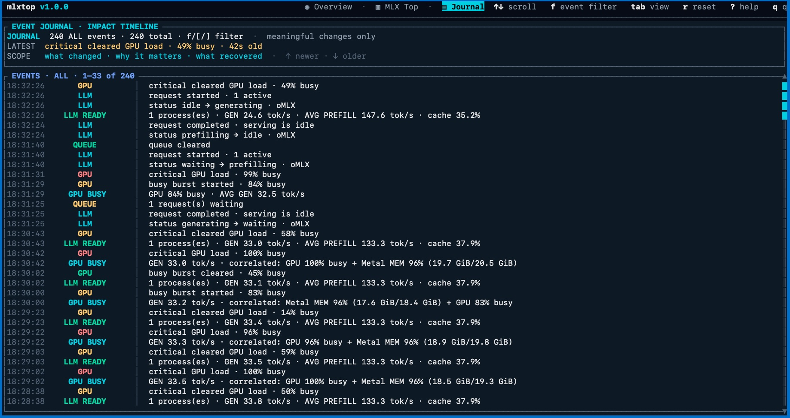

# mlxtop

**A `top` for your local LLM on Mac.**

See which models are running, how much memory they use, and how busy your Mac’s
GPU is. With oMLX, you can also follow generation speed and request activity as
your model responds.


[Try it](#try-it) · [Runtime support](#runtime-support-and-limitations) ·
[User guide](docs/USER_GUIDE.md) · [Changelog](CHANGELOG.md) · [Report a bug](https://github.com/maximpri/mlxtop/issues)

## Try it

You’ll need an Apple Silicon Mac or a Linux machine and a terminal with
Unicode and color support.
The v1.1.1 binary targets macOS 11 or later and was tested on macOS 26.5.1.
See the [release notes](https://github.com/maximpri/mlxtop/releases/tag/v1.1.1)
for compatibility details.

[**Download the macOS disk image (.dmg)**](https://github.com/maximpri/mlxtop/releases/download/v1.1.1/mlxtop-1.1.1-aarch64-apple-darwin.dmg).
Open it, double-click **Install mlxtop.pkg**, and follow the installer. Then
open Terminal and run `mlxtop`. This installs in `/usr/local/bin` and requires
an administrator account. The package is unsigned and not Apple notarized.

### Install from Terminal

To install in your home directory without sudo:

```sh
curl -fsSL https://raw.githubusercontent.com/maximpri/mlxtop/main/scripts/install.sh | sh
```

The installer checks the download’s SHA-256 checksum and places `mlxtop` in
`~/.local/bin`. No Rust toolchain or sudo is needed. Then run:

```sh
~/.local/bin/mlxtop
```

Add `~/.local/bin` to your `PATH` to run it as `mlxtop` from any terminal.

## Configuration

Create `~/.config/mlxtop/config.json` to customize mlxtop. All fields are optional,
and anything you leave out keeps its built-in default.

```json
{
  "interval": 2,
  "history": 500,
  "omx": {
    "host": "127.0.0.1",
    "port": 8080
  },
  "memory_warn_load": 70,
  "memory_critical_load": 85,
  "gpu_warn_load": 75,
  "gpu_critical_load": 90,
  "gpu_warn_exit": 70,
  "swap_warn_rate": 1048576,
  "swap_critical_rate": 16777216,
  "swap_warn_exit": 2097152,
  "compression_warn_rate": 67108864,
  "compression_warn_exit": 33554432
}
```

| Field | Type | Default | Description |
| --- | --- | --- | --- |
| `interval` | integer | 1 | Refresh interval in seconds (1–60) |
| `history` | integer | 300 | Chart/journal history size (20–3600) |
| `omx.host` | string | "127.0.0.1" | oMLX server host |
| `omx.port` | integer | 8080 | oMLX server port |
| `memory_warn_load` | integer | 70 | Memory load (%) that turns the memory indicator yellow |
| `memory_critical_load` | integer | 85 | Memory load (%) that turns it red |
| `gpu_warn_load` | integer | 75 | GPU load (%) reported as "loaded" and shown yellow |
| `gpu_critical_load` | integer | 90 | GPU load (%) reported as "saturated", shown red, and correlated as GPU saturation |
| `gpu_warn_exit` | integer | 70 | GPU load (%) below which "GPU BUSY" clears |
| `swap_warn_rate` | integer | 1 MiB/s | Swap churn that counts as light paging |
| `swap_critical_rate` | integer | 16 MiB/s | Swap churn that counts as thrashing |
| `swap_warn_exit` | integer | 2 MiB/s | Swap churn below which "PAGING ACTIVE" clears |
| `compression_warn_rate` | integer | 64 MiB/s | Compression churn that raises "COMPRESSION ACTIVE" |
| `compression_warn_exit` | integer | 32 MiB/s | Compression churn below which it clears |

Rates are bytes per second; loads are percentages.

### Precedence

- **CLI arguments override config file values.** `--interval` and `--history` win
  over `interval` and `history`.
- **Explicit endpoint settings override discovery.** mlxtop reads
  `~/.config/omlx-coding/server.env` to find a running oMLX server, but a host or
  port you set under `omx` always wins. Each field resolves on its own, so setting
  only `omx.port` keeps the discovered host.
- **Out-of-range `interval` or `history` in the file falls back to the default**
  and is recorded in the diagnostics log, so a typo in `config.json` cannot stop
  mlxtop from starting. The same value passed on the command line is still a hard
  error, because you can see the message straight away.
- **Nonsensical thresholds are clamped, not rejected.** Percentages are held to
  0–100, a critical level is never allowed below its warning level, and a
  hysteresis exit is never allowed above the level that turns the state on, so a
  stray value cannot silently remove a severity band. A config file that fails to
  parse is logged to the diagnostics log and ignored in full.

## Usage

You should see live memory and GPU readings as soon as the dashboard opens.
It works without a model running, so you can look around before starting one.
Once mlxtop detects a supported runtime, it adds the available model information.
oMLX provides the most detail, including response speed and request activity.

### Watch it during a conversation

1. Leave mlxtop open and send a message to your local model. Any short prompt
   will do, such as “Explain how a rainbow forms in three sentences.”
2. Watch Overview while the model responds. You’ll see memory and GPU activity.
   With live oMLX data, you’ll also see how fast it processes your prompt and
   writes the answer.
3. Press `2` to inspect model processes or `3` to open the event journal.
   Press `q` when you’re done.

The numbers will depend on your Mac, model, and prompt. A dash in the dashboard
means a measurement isn’t available. Response speed requires a runtime that
reports it.

For a text report you can use in a terminal or over SSH:

```sh
~/.local/bin/mlxtop --once
```

This prints memory, paging, GPU, and available model information, then exits.
If you used the macOS installer or Cargo, use `mlxtop --once` instead.

You don’t need an account or a cloud API key. Use whatever local model you
already have running. mlxtop doesn’t download models or send prompts for you.
Installation needs internet access to download the release, or the source and
Rust dependencies if you build it yourself.
If your oMLX server requires a key, follow the
[runtime setup guide](docs/USER_GUIDE.md#omlx-telemetry).

### Views and controls

Use mlxtop to see whether a slow reply coincides with a busy GPU or your Mac
moving memory to disk. It’s also useful for watching memory use as you try a
larger model or work through a longer conversation.

| View | What it shows |
| --- | --- |
| Overview | Model status, per-request prompt load, generation and prefill rates when available, process memory, queue activity, and GPU use |
| MLX Top | Running model processes and the resources they use |
| Journal | Request activity and changes in resource use during the session |

Here’s the Journal during an oMLX session:



Both screenshots show oMLX workloads. The numbers illustrate the display and
aren’t benchmarks.

| Key | Action |
| --- | --- |
| `1` / `2` / `3` | Open Overview / MLX Top / Journal |
| `Tab` | Switch views |
| `p` / `Space` | Pause or resume sampling |
| `+` / `-` | Change refresh interval |
| `?` | Show help |
| `q` | Quit |

The [user guide](docs/USER_GUIDE.md#controls) covers process filtering, sorting,
and journal navigation.

<details>
<summary>Build from source</summary>

If you prefer to build it yourself, you’ll need Rust 1.88 or newer with Cargo
and Git:

```sh
git clone https://github.com/maximpri/mlxtop.git
cd mlxtop
cargo install --path . --locked
mlxtop
```

If your shell can’t find `mlxtop`, run `~/.cargo/bin/mlxtop` or add
`~/.cargo/bin` to your `PATH`.

</details>

## Runtime support and limitations

mlxtop is built for macOS on Apple Silicon and for Linux (x86_64 and
aarch64). Windows and Intel Macs aren’t supported targets for this release.

On Linux, memory and swap come from `/proc/meminfo`, paging rates from
`/proc/vmstat`, pressure level from the `MemAvailable` ratio blended with
`/proc/pressure/memory` stalls, GPU readings from `nvidia-smi` when present,
and thermals from `/sys/class/thermal`. Counters without a source are shown
as unavailable. Build from source with `cargo install --path . --locked`.

| Runtime | Available information |
| --- | --- |
| oMLX | Models, processes, prompt and response speed, requests, cache activity, and extra memory counters when available |
| llama.cpp / llama-server | Active slots and summed output counts; average rates and active/deferred queue counts when `/metrics` is enabled. Optional usage file adds full prompt history alongside native polling. |
| KoboldCpp | Last reported input/output counts and rates through `/api/extra/perf` |
| MLX-LM, Ollama, LM Studio, LocalAI | Process detection (including Python entrypoints and LM Studio's `llmster`); completed request counts through an optional client-written usage file |

Overview integrates prompt load with generation and prefill on wide terminals.
It shows the latest count, change from the previous observed request, freshness,
and cached/uncached segments when reported. Queue and OS process-footprint
charts complement the system metrics. First-token latency appears only when
explicitly measured client timings are supplied. See the
[operator charts](docs/USER_GUIDE.md#operator-charts) for scales and data sources.
Prompt counts also appear in the static report. Journal records each
observed request with its prompt count and request-specific cached count when
available. Polling is sampled: requests that finish between polls can be missed.
See [request telemetry setup](docs/USER_GUIDE.md#request-token-telemetry) for
provider selection, custom ports and response-only integrations. The optional
[Python client helper](scripts/record_usage.py) extracts counters from completed
responses and appends them to the usage file without storing response content.

The oMLX connection defaults to `127.0.0.1:8080` and reads settings from
`~/.config/omlx-coding/server.env`. If you’re missing live readings, check the
[setup guide](docs/USER_GUIDE.md#omlx-telemetry).

The available readings depend on your runtime. Missing measurements are shown
as unavailable. GPU activity reflects the whole system, not individual models.
mlxtop never estimates response speed from CPU or GPU use. When live oMLX data
is unavailable, it may use recent completion logs and show how old those readings
are.

The dashboard can help you spot a slowdown and the conditions around it, but
it can’t prove what caused it. The Journal only covers the current session.

## Privacy and local access

mlxtop runs without sudo and has no analytics. It reads system counters,
process information, and supported provider APIs and logs. Your project files
and model settings stay untouched, and it doesn’t send inference requests.

Diagnostic logs are saved locally at `~/Library/Logs/mlxtop/mlxtop.log` on
macOS and `~/.local/state/mlxtop/mlxtop.log` on Linux (following
`XDG_STATE_HOME` when set). They
include counters and model or provider names, but exclude prompts, model output,
request bodies, and API keys. These logs aren’t uploaded. By default, provider
credentials are sent only to endpoints on your own machine.

See the [data sources](docs/USER_GUIDE.md#data-sources-and-privacy),
[crash diagnostics](docs/USER_GUIDE.md#crash-diagnostics), and
[security policy](SECURITY.md) for details.

## Help and contributions

The [user guide](docs/USER_GUIDE.md) covers setup, controls, troubleshooting,
and the readings in each view. The [roadmap](https://github.com/maximpri/mlxtop/blob/main/OPEN_SOURCE_ROADMAP.md) describes
planned work.

If something breaks, [open an issue](https://github.com/maximpri/mlxtop/issues)
with your mlxtop version (`mlxtop --version`), macOS version, Mac model, runtime,
and steps to reproduce it. Remove private data from screenshots and logs.
Use [SECURITY.md](SECURITY.md) to report a vulnerability.

Documentation fixes, bug reports, and provider adapters are welcome. If a setup
step tripped you up, improving it is a useful place to start. Read
[CONTRIBUTING.md](CONTRIBUTING.md) for development checks and design guidelines.
For larger changes, open an issue first so we can discuss the approach.

## Acknowledgments

mlxtop was developed with Duet coding agent.

## License

[MIT](LICENSE). Dependencies keep their [own licenses](THIRD_PARTY_NOTICES.md).
Contributions use the same MIT terms. mlxtop is an independent project and
isn’t an Apple product.
